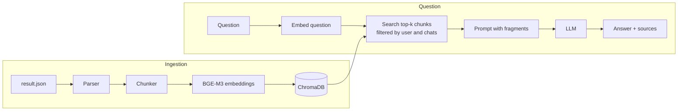

# Telegram Chat Q&A (RAG)

Ask questions about Telegram chat history in plain language and see which part of the chat each answer came from.

> **Context:** pet project that started as an internal tool for a small company in Moscow, where five employees used it to find information in work chats. Python, FastAPI, ChromaDB, BGE-M3. 2026.

<!-- Add a screenshot here:  -->

## Features

- Upload a Telegram chat export (`result.json` from Telegram Desktop). Processing runs in the background with a progress bar and an ETA.
- Pause and resume processing. If the server restarts mid-way, the job continues from the last saved chunk.
- Ask questions about one chat, a group of chats or all of them.
- Every answer lists its sources: date range, participants and relevance score.
- User accounts with JWT authentication. Each user sees only their own chats.
- The LLM provider is one setting in `.env`: Ollama (local), Gemini or Groq.

## Tech stack

| Layer | Technology |
| --- | --- |
| Backend | Python, FastAPI, Uvicorn, SQLAlchemy, SQLite, PyJWT, pydantic-settings |
| Retrieval | sentence-transformers with `BAAI/bge-m3` embeddings, ChromaDB (cosine distance) |
| LLM | Ollama, Gemini or Groq over HTTP (httpx) |
| Frontend | Vanilla JavaScript, HTML, CSS, served by FastAPI |
| Infrastructure | Docker, Docker Compose |

## Architecture



- **Parsing** turns the Telegram export into a flat list of messages (sender, date, text), skipping service messages and media without text.
- **Chunking** groups messages into conversations: a new chunk starts after a 15-minute pause or at 2,000 characters, and the last 2 messages carry over to keep context. All three values are configurable.
- **Storage:** chunks and their metadata (chat, owner, dates, participants) go into one ChromaDB collection. Every search filters by owner, so users never see each other's data. Users, chats, groups and processing status live in SQLite.
- **Answering:** the top-k fragments (5 by default) go into a prompt that tells the model to answer only from the fragments and to say so when the answer is not there.
- **LLM providers** share one small interface, and a factory picks the implementation from `LLM_PROVIDER`.

## Project structure

```text
backend/
  api/          FastAPI app, JWT auth, routes: auth, chats, groups, qa
  parsing/      Telegram export parser
  chunking/     message grouping into conversations
  embeddings/   BGE-M3 wrapper (CUDA, Apple MPS or CPU)
  vectorstore/  ChromaDB wrapper, batched inserts, resume support
  rag/          retrieval and prompt building
  llm/          Ollama, Gemini and Groq clients behind one interface
  db/           SQLAlchemy models and repository
  config.py     settings from .env
frontend/       single-page UI
run.py          entry point
```

## Getting started

### Docker

```bash
cp .env.example .env    # set SECRET_KEY, LLM_PROVIDER and the provider's API key
docker compose up --build
```

Open http://localhost:8000. Interactive API docs are at http://localhost:8000/docs.

The first start downloads the BGE-M3 model (about 1.5 GB). It is cached in a Docker volume, so later starts are fast.

### Local

```bash
python3 -m venv venv && source venv/bin/activate
pip install -r requirements.txt
cp .env.example .env
python run.py
```

### Getting a chat export

In Telegram Desktop open the chat, choose **Export chat history**, select the **JSON** format and upload the resulting `result.json`.

## What I'd improve next

- Hash passwords with bcrypt or Argon2 instead of plain SHA-256.
- Restrict CORS to the app's own origin.
- Add pytest tests for the parser, the chunker and the per-user search filters.
- Measure answer quality on a fixed set of questions when changing chunk size or `top_k`.
